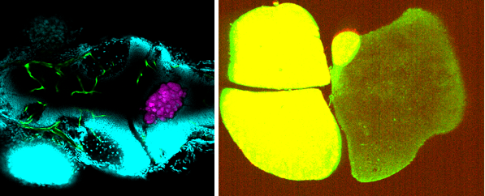

# hybrid-tumor-analysis-pipeline
End-to-end multi-stage computer vision pipeline for tumor aggressiveness prediction from 3D microscopy under real clinical constraints, combining classical image processing, deep-learning segmentation, rule based segmentation refinement, and classical feature-based machine learning.

# 3D Medical Imaging CV Pipeline

*Representative segmentation results from both imaging systems (placeholder - to be added)*

## Overview

End-to-end pipeline for tumor aggressiveness prediction from 3D microscopy images, designed for real-world constraints: no labels, small cohorts (<30 samples), and noisy multi-channel acquisitions.

Standard deep learning approaches fail in this regime. This work demonstrates a pragmatic multi-stage methodology combining classical bootstrapping, pseudo-label generation, deep learning, rule-based refinement, and feature-based classification.

## The Challenge

*Multi-channel microscopy examples showing data artifacts

Real-world 3D microscopy data presents technical challenges absent from clean benchmarks:

**System A:** 4-channel volumetric stacks (512×512×~30 slices). Challenges: inter-channel intensity variability, incomplete spatial coverage, multi-structure segmentation.

**System B:** 2-channel 3D image stacks with inter-channel spatial misalignment and fluorescence leakage artifacts.

Common constraints across both systems:
- **No manual annotations:** 3D labeling is prohibitively expensive
- **Noisy acquisitions:** Fluorescence leakage, intensity drift, spatial misalignment
- **Small cohorts:** <30 samples insufficient for end-to-end deep learning
- **High variability:** Non-standardized acquisition protocols

## Methodology

### Stage 1: Registration & Alignment
Multi-channel registration using ANTs to correct spatial misalignment.

### Stage 2: Classical Bootstrapping
Generate initial segmentations on unlabeled data using domain-informed classical CV (bilateral filtering, thresholding, hysteresis, morphology, GMM). Create pseudo-labels for deep learning.

### Stage 3: Deep Learning Refinement
Train nnU-Net on pseudo-labels with:
- Custom asymmetric loss (1.1× weighting) and confusion-aware loss to reduce critical false negatives
- Extensive 3D augmentation for small-data robustness

### Stage 4: Classical Post-Processing
Correct systematic DL failures using rule-based filters (largest object selection, morphological cleanup, active contours). Retrain on challenging channels when needed.

### Stage 5: Feature Engineering
Extract 3D geometrically-informative features using computational geometry algorithms (marching cubes).

### Stage 6: Classification
Classical ML (Random Forest, SVM, linear regression) for prediction in low-data regime.

## Key Technical Contributions

- **Pseudo-label refinement workflow:** Iterative bootstrap → train → QC → retrain cycle
- **Task-aligned loss design:** Optimized for downstream pipeline requirements, not pixel-level metrics
- **Multi-channel artifact correction:** Cross-channel leakage compensation and intensity normalization
- **Memory-optimized 3D processing:** Efficient handling of gigabyte-scale volumetric data

## Technical Stack

**Core:** Python, PyTorch, nnU-Net, ANTsPy, scikit-image, scikit-learn  
**Preprocessing:** OpenCV, scipy, nibabel, numpy  
**Registration:** ANTs (Advanced Normalization Tools)

## Status

- ✅ Core pipeline implementation
- ✅ Multi-system validation
- 🔄 Pipeline extensions and optimization
- 🔄 Representative visualizations (updated upon thesis completion)
- 🔄 Comprehensive documentation

---

Developed as part of MSc thesis research at Technion
